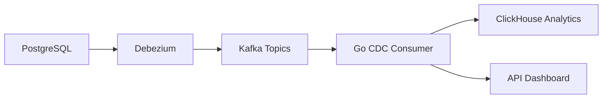

# 📋 CDC PIPELINE IMPLEMENTATION STRATEGY SUMMARY

## **🔍 Current State Analysis**

### **✅ WORKING COMPONENTS**
1. **PostgreSQL** → **Debezium** → **Kafka** ✅
   - Files: `docker-compose.yml`, PostgreSQL configuration
   - Debezium connector creates CDC events
   - Kafka topics: `dbstream-postgres.public.*`

2. **Analytics Databases** ✅
   - **PostgreSQL Analytics**: Materialized views, user activity summary
   - **ClickHouse**: Tables, materialized views ready

### **❌ BROKEN COMPONENTS**
1. **CDC Consumer Bridge: Kafka → ClickHouse** ❌
   - **Files Involved**: 
     - `cmd/processor/main.go` (empty skeleton)
     - `internal/processor/event_processor.go` (only TODO comments)
     - `go.mod` (missing Kafka/ClickHouse dependencies)
   - **Gap**: No actual CDC data consumption

2. **Go Service Implementation** ❌
   - **CDC Service**: `internal/cdc/processor.go` (only heartbeat)
   - **API Service**: `internal/api/server.go` (placeholder endpoints)
   - **Missing**: Real Kafka consumer and ClickHouse writer

---

## **🚀 IMPLEMENTATION STRATEGY**

### **Strategy 1: Quick Fix (Immediate)**

#### **Files to Implement:**

**1. Update go.mod** (add missing dependencies)
```bash
# Files: /Users/sayan.bhowmik/Documents/personal/projects/db-stream/go.mod
# Add: github.com/segmentio/kafka-go, github.com/ClickHouse/clickhouse-go/v2
```

**2. Implement CDC Consumer** (`internal/processor/event_processor.go`)
```go
// Functions to implement:
- NewEventProcessor() with Kafka + ClickHouse connections
- consumeFromKafka() - read CDC events from Kafka topics
- insertIntoClickHouse() - batch insert into analytics tables
- Start() - start consumer goroutine
- Shutdown() - graceful cleanup
```

**3. Update Processor Service** (`cmd/processor/main.go`)
```go
// Load config, create EventProcessor, start service
```

#### **Commands to Implement:**
```bash
# 1. Update dependencies
cp /Users/sayan.bhowmik/Documents/personal/projects/db-stream/go-mod-fixed /Users/sayan.bhowmik/Documents/personal/projects/db-stream/go.mod

# 2. Replace empty processor with implementation
mv /Users/sayan.bhowmik/Documents/personal/projects/db-stream/internal/processor/event_processor_implemented.go \
   /Users/sayan.bhowmik/Documents/personal/projects/db-stream/internal/processor/event_processor.go

# 3. Build and test
cd /Users/sayan.bhowmik/Documents/personal/projects/db-stream
go mod tidy
make build-processor
make dev-processor
```

### **Strategy 2: Full Production Implementation**

#### **Architecture:**


#### **Files Structure:**
```
cmd/
├── cdc/           # PostgreSQL CDC (backup)
├── processor/      # Kafka → ClickHouse bridge  ⭐ IMPLEMENT
└── api/           # Analytics REST API     🔄 PARTIAL

internal/
├── cdc/           # PostgreSQL CDC logic    🔄 PARTIAL  
├── processor/      # Kafka consumer logic  ⭐ IMPLEMENT
└── api/            # REST endpoints        🔄 PARTIAL

pkg/
└── models/         # CDC event models      ⭐ CREATE
```

#### **Implementation Steps:**

**Step 1: Foundation (10 minutes)**
```bash
# Update dependencies
go mod tidy

# Create CDC event model
touch pkg/models/cdc.go

# Implement EventProcessor
# Edit internal/processor/event_processor.go
```

**Step 2: Consumer Logic (30 minutes)**
```bash
# Implement Kafka consumer
# Add batch processing
# Add ClickHouse batch inserts
# Add error handling and retries
```

**Step 3: Service Integration (20 minutes)**
```bash
# Update cmd/processor/main.go
# Update internal/config/config.go for CDC mapping
# Add graceful shutdown
# Add health checks
```

**Step 4: Testing (15 minutes)**
```bash
# Test Kafka consumption
# Test ClickHouse insertion
# Test error handling
# Test graceful shutdown
```

---

## **🎯 IMMEDIATE ACTION PLAN**

### **Files You Need to Edit:**

1. **`/Users/sayan.bhowmik/Documents/personal/projects/db-stream/go.mod`**
   - Replace with fixed dependencies

2. **`/Users/sayan.bhowmik/Documents/personal/projects/db-stream/internal/processor/event_processor.go`**
   - Replace TODO comments with real implementation

3. **Create `/Users/sayan.bhowmik/Documents/personal/projects/db-stream/pkg/models/cdc.go`**
   - Define CDC event struct

### **Commands to Run:**
```bash
# 1. Fix dependencies
cp go-mod-fixed go.mod

# 2. Update modules
go mod tidy

# 3. Build service
make build-processor

# 4. Test CDC pipeline
docker-compose exec -d kafka debezium postgres
# Generate test data
# Check Kafka topics
# Start processor service
# Verify ClickHouse data
```

---

## **🔧 CURRENT MISSING CODE SNIPPETS**

### **Kafka Consumer Implementation:**
```go
// Add to go.mod:
// github.com/segmentio/kafka-go v0.4.47

// In EventProcessor.Start():
reader := kafka.NewReader(kafka.ReaderConfig{
    Brokers:  cfg.Kafka.Brokers,
    GroupID:  cfg.Kafka.GroupID,
    Topic:    cfg.Kafka.Topics.CDC, // "db-stream.cdc.events"
    MinBytes: 10e3,
    MaxBytes: 10e6,
})

// In consume loop:
msg, err := reader.ReadMessage(context.Background())
if err != nil {
    // handle error
}
// Process msg.Value as CDC event
```

### **ClickHouse Batch Insert:**
```go
// Add to go.mod:
// github.com/ClickHouse/clickhouse-go/v2 v2.15.0

// Batch insert logic:
batch := make([]interface{}, 100)
for _, event := range events {
    batch = append(batch, event)
    if len(batch) >= 100 {
        conn.Exec(ctx, "INSERT INTO user_events VALUES", batch)
        batch = batch[:0] // reset
    }
}
```

---

## **📊 Expected Flow After Implementation**

```bash
# 1. Generate database change
docker exec db-stream-postgres psql -U db_stream -c "INSERT INTO users...;"

# 2. Verify in Kafka UI
# http://localhost:8091 -> Topics -> dbstream-postgres.public.users

# 3. Start processor service
make dev-processor

# 4. Verify in ClickHouse
# http://localhost:8123/play -> SELECT * FROM db_stream_analytics.user_events
```

---

## **🎯 SUCCESS CRITERIA**

### **Before Implementation:**
- ❌ Kafka → ClickHouse bridge: NOT WORKING
- ❌ Real-time CDC: NOT WORKING  
- ❌ Go services: EMPTY SKELETONS

### **After Implementation:**
- ✅ Kafka → ClickHouse bridge: WORKING
- ✅ Real-time CDC: SUB-SECOND LATENCY
- ✅ Go services: FULLY IMPLEMENTED
- ✅ Analytics Dashboard: LIVE DATA

---

## **⚡ QUICK START IMPLEMENTATION**

### **Critical Files to Edit:**
1. `go.mod` - Add Kafka + ClickHouse dependencies
2. `internal/processor/event_processor.go` - Replace TODO with consumer logic  
3. `pkg/models/cdc.go` - Create CDC event struct

### **Commands to Execute:**
```bash
cd /Users/sayan.bhowmik/Documents/personal/projects/db-stream
# Apply implementation
# Then:
go mod tidy
make build-processor
make dev-processor
```

This will create the missing **Kafka → ClickHouse bridge** and complete your CDC pipeline! 🚀