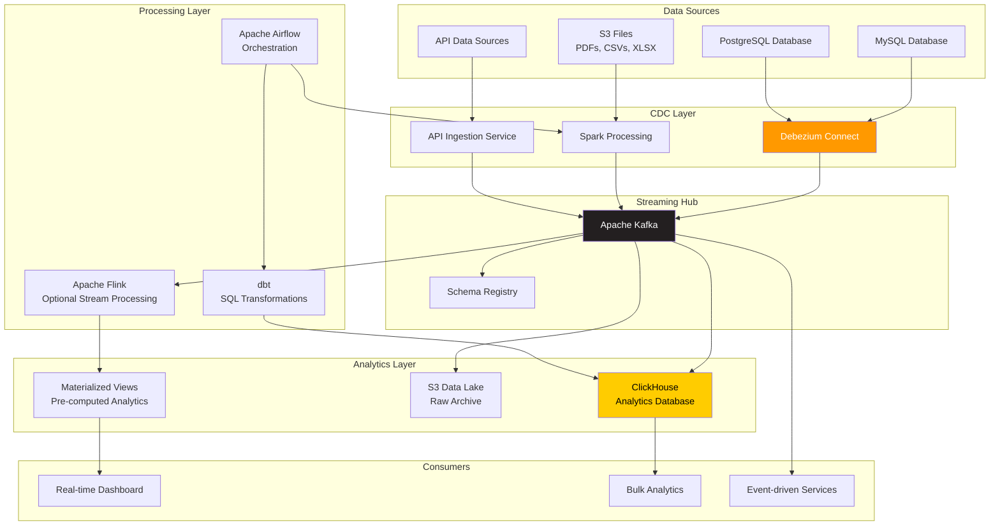
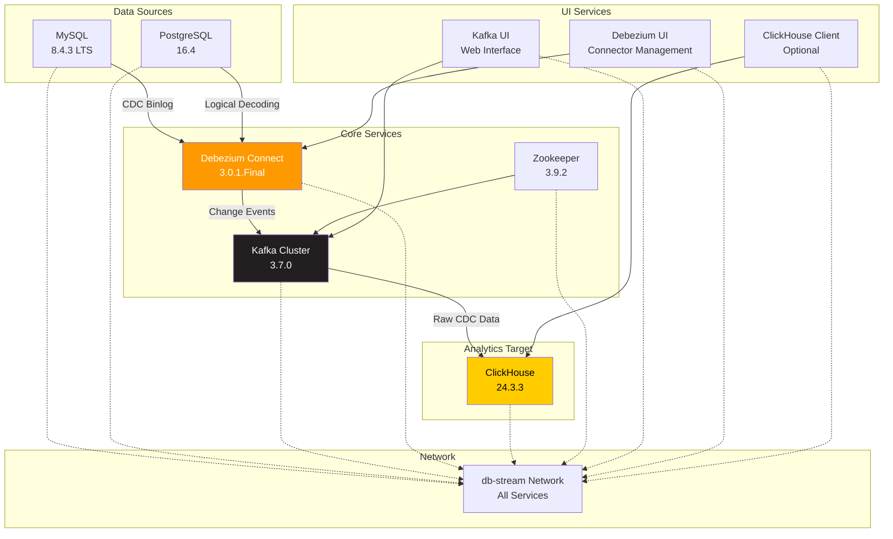
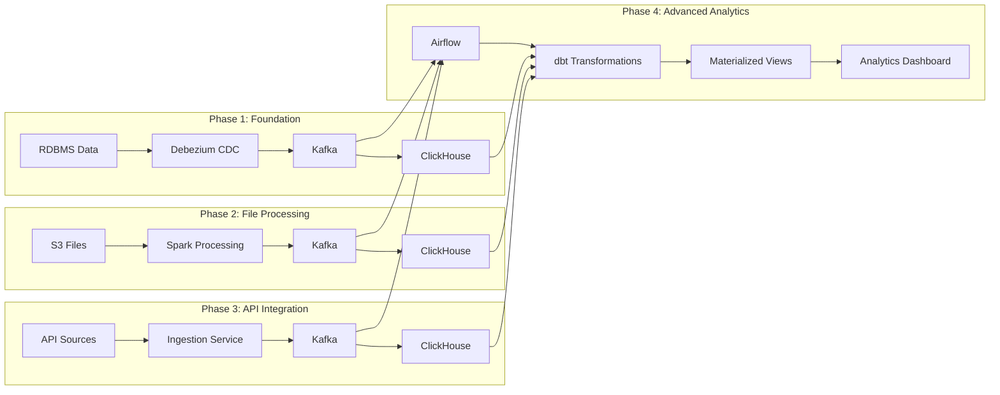
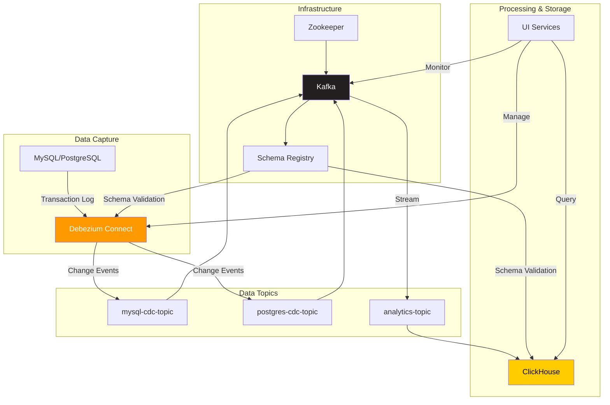
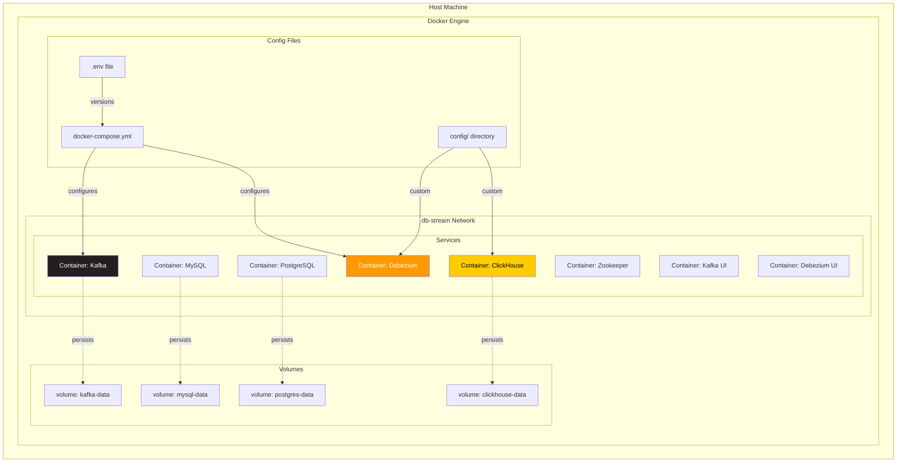
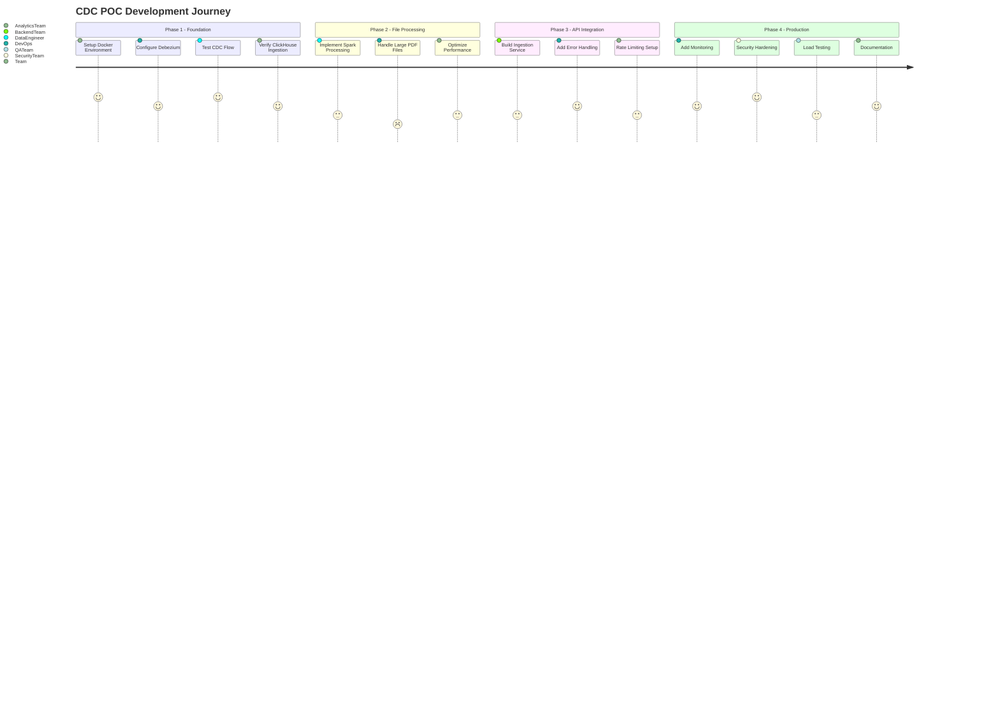
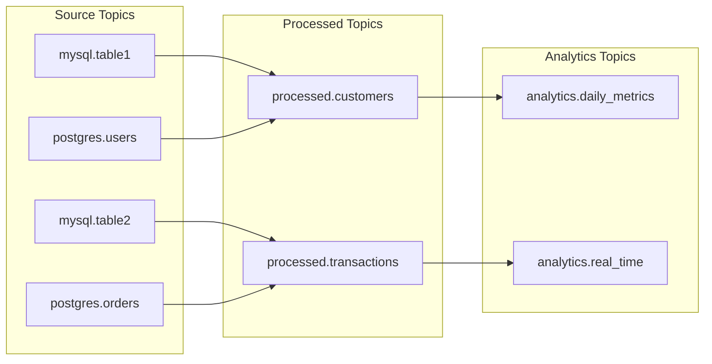
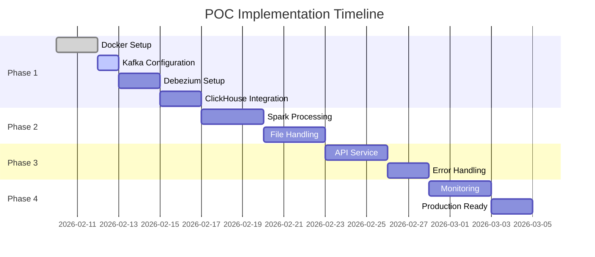

# Architecture Diagrams & Visualizations

This document contains all Mermaid diagrams used throughout the DB-Stream project documentation. These diagrams provide visual representations of the architecture, data flow, and implementation details.

## Table of Contents

1. [Overall Data Architecture](#overall-data-architecture)
2. [Phase 1: Foundation Architecture](#phase-1-foundation-architecture)
3. [Complete POC Pipeline Flow](#complete-poc-pipeline-flow)
4. [Service Dependencies & Data Flow](#service-dependencies--data-flow)
5. [Docker Architecture Layout](#docker-architecture-layout)
6. [Development to Production Flow](#development-to-production-flow)

---

## Overall Data Architecture

**Key Insights:**
- **Centralized Streaming**: Kafka serves as the central hub for all data
- **Specialized Processing**: Different tools for different data types
- **Multiple Consumers**: Various downstream systems can consume the same data
- **Scalable Architecture**: Each layer can scale independently

---

## Phase 1: Foundation Architecture

**Phase 1 Focus:**
- **Core Infrastructure**: Kafka, Zookeeper, Debezium setup
- **CDC Pipeline**: MySQL and PostgreSQL to ClickHouse
- **Monitoring**: UI tools for visibility and management
- **Network Isolation**: All services on dedicated network

---

## Complete POC Pipeline Flow

**Phased Development Approach:**
- **Incremental Build**: Each phase builds upon previous work
- **Parallel Streams**: Multiple data sources converge in Kafka
- **Unified Processing**: All data flows through common transformation layer
- **Analytics Layer**: Final destination with advanced capabilities

---

## Service Dependencies & Data Flow

**Service Interaction Details:**
- **Infrastructure First**: Zookeeper → Kafka → Schema Registry
- **Data Capture**: Database → Debezium → Kafka Topics
- **Schema Management**: Centralized validation and evolution
- **UI Integration**: Monitoring and management capabilities

---

## Docker Architecture Layout

**Container Organization:**
- **Isolated Network**: `db-stream` network for all containers
- **Persistent Storage**: Named volumes for data persistence
- **Configuration Management**: Centralized config files
- **Customization**: Dockerfiles for specialized configurations

---

## Development to Production Flow

**Development Timeline:**
- **Phase 1**: Foundation setup and basic CDC (Weeks 1-2)
- **Phase 2**: File processing capabilities (Weeks 3-4)
- **Phase 3**: API integration (Weeks 5-6)
- **Phase 4**: Production readiness (Weeks 7-8)

---

## Additional Reference Diagrams

### Kafka Topic Strategy

### Data Flow Timeline

---

## Diagram Usage Guidelines

### **When to Use Each Diagram:**

1. **Overall Data Architecture**: For high-level stakeholder presentations
2. **Phase 1 Foundation**: For development team implementation guidance
3. **Complete POC Pipeline**: For project planning and roadmap discussions
4. **Service Dependencies**: For technical architecture reviews
5. **Docker Layout**: For DevOps and infrastructure teams
6. **Development Journey**: For project management and team coordination

### **Color Coding:**
- **Orange** (`#ff9900`): Debezium/CDC components
- **Black** (`#231f20`): Kafka/streaming infrastructure
- **Yellow** (`#ffcc00`): Analytics and storage components

### **Customization Tips:**
- Update version numbers as components are upgraded
- Add new services as the architecture evolves
- Modify styling to match organization's brand guidelines
- Include performance metrics and KPIs where relevant

---

*Last Updated: 2026-02-10*
*Document Version: 1.0*