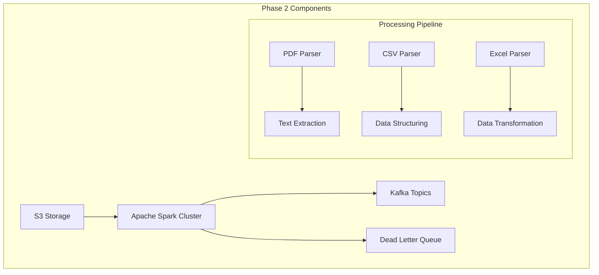
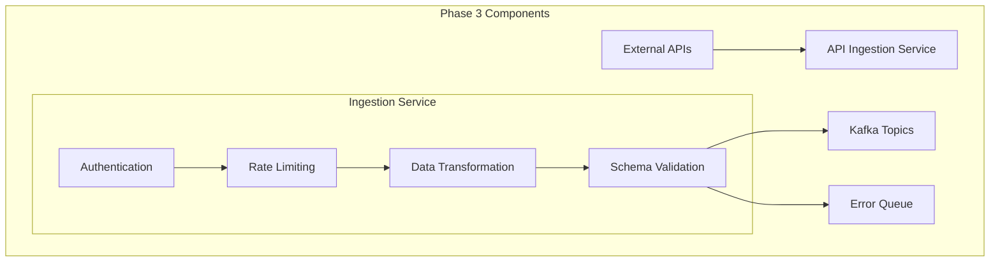
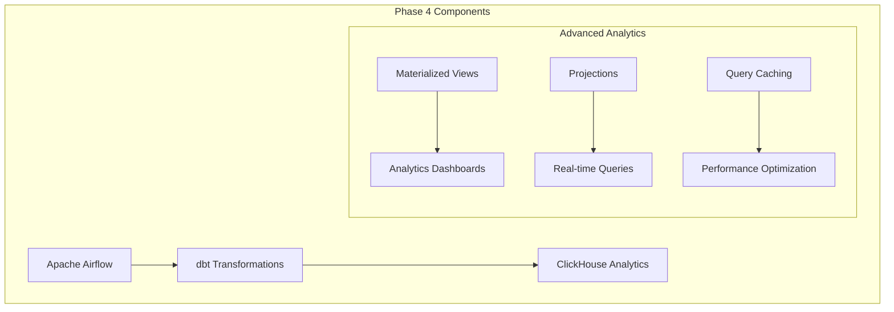

# Future Milestones & Roadmap

## Introduction

This document outlines the long-term vision and incremental development milestones for the DB-Stream project. The roadmap is designed to transform the initial POC into a production-ready, enterprise-scale data streaming platform.

## Strategic Vision

### **Mission Statement**
To build a comprehensive, real-time data platform that enables organizations to make data-driven decisions with sub-second latency, supporting diverse data sources and complex analytical workloads.

### **Core Principles**
- **Real-time First**: Prioritize low-latency data processing
- **Scalability**: Architecture designed for enterprise growth
- **Flexibility**: Support for diverse data types and use cases
- **Reliability**: Enterprise-grade reliability and fault tolerance
- **Open Source**: Leverage and contribute to open-source communities

## Incremental Development Phases

### **Phase 1: Foundation ✅ (Current Sprint)**
**Timeline**: Weeks 1-2  
**Status**: Planning Complete, Implementation Pending

**Objectives**:
- ✅ Core infrastructure setup (Kafka, Zookeeper, Debezium)
- ✅ CDC pipeline from MySQL/PostgreSQL to Kafka
- ✅ ClickHouse analytics database integration
- ✅ Basic UI tools for monitoring

**Success Criteria**:
- CDC operational with <5 second latency
- End-to-end data flow verified
- Monitoring tools functional
- Documentation complete

---

### **Phase 2: File Processing Pipeline**
**Timeline**: Weeks 3-4  
**Complexity**: Medium-High  
**Team Required**: Data Engineer, DevOps Engineer

#### **Primary Objectives**
1. **S3 Integration**: Connect to Amazon S3 for file ingestion
2. **Large File Processing**: Handle 100+ page PDFs efficiently
3. **Multi-format Support**: Process PDFs, CSVs, XLSX files
4. **Distributed Processing**: Spark cluster for scalable processing

#### **Technical Components**
- **Apache Spark**: Distributed file processing engine
- **S3 Access Layer**: Secure file retrieval from S3 buckets
- **PDF Processing Library**: Extract text and metadata from PDFs
- **Data Format Parsers**: Handle CSV and Excel files
- **Error Handling**: Robust error recovery and retry mechanisms

#### **Architecture Additions**

#### **Key Features**
- **Intelligent File Detection**: Automatically detect file types
- **Memory-Efficient Processing**: Handle large files without OOM
- **Parallel Processing**: Distribute work across Spark workers
- **Progress Tracking**: Monitor processing status and progress
- **Quality Validation**: Data quality checks and validation

#### **Success Criteria**
- Process 100+ page PDFs within 30 seconds
- Handle mixed file formats in single pipeline
- Achieve 99% accuracy in text extraction
- Process 1000+ files concurrently
- Maintain <5 minute end-to-end latency

---

### **Phase 3: API Integration Layer**
**Timeline**: Weeks 5-6  
**Complexity**: Medium  
**Team Required**: Backend Engineer, DevOps Engineer

#### **Primary Objectives**
1. **REST API Ingestion**: Connect to external REST APIs
2. **GraphQL Support**: Support for modern GraphQL endpoints
3. **Rate Limiting**: Implement intelligent rate limiting
4. **Authentication**: Support for various auth mechanisms
5. **Schema Registry Integration**: API data schema validation

#### **Technical Components**
- **API Ingestion Service**: Custom service for API data retrieval
- **Rate Limiting Engine**: Token bucket algorithm implementation
- **Authentication Layer**: OAuth2, API Key, Basic Auth support
- **Data Transformation**: API response to Kafka format conversion
- **Monitoring Dashboard**: API performance and error tracking

#### **Architecture Additions**

#### **Key Features**
- **Multi-API Support**: Handle multiple APIs simultaneously
- **Flexible Scheduling**: Configurable polling intervals
- **Error Recovery**: Automatic retry with exponential backoff
- **Data Enrichment**: Add metadata and timestamps
- **Version Management**: Handle API version changes

#### **Success Criteria**
- Support 50+ concurrent API connections
- Handle 10,000+ API calls per minute
- Achieve 99.9% uptime for ingestion service
- Maintain <1 minute data latency
- Support multiple authentication methods

---

### **Phase 4: Advanced Analytics & Orchestration**
**Timeline**: Weeks 7-8  
**Complexity**: High  
**Team Required**: Data Engineer, Analytics Engineer, DevOps

#### **Primary Objectives**
1. **Apache Airflow Integration**: Workflow orchestration
2. **dbt Transformations**: SQL-based data transformations
3. **Advanced Analytics**: Complex analytical queries
4. **Materialized Views**: Pre-computed analytics tables
5. **Performance Optimization**: Query and storage optimization

#### **Technical Components**
- **Apache Airflow**: Workflow scheduling and management
- **dbt Core**: SQL transformation framework
- **Advanced ClickHouse Features**: Materialized views, projections
- **Performance Monitoring**: Query performance tracking
- **Automated Testing**: Data quality and pipeline testing

#### **Architecture Additions**

#### **Key Features**
- **Automated Workflows**: Scheduled data transformations
- **Incremental Models**: Efficient incremental processing
- **Data Lineage**: Track data flow and transformations
- **Quality Testing**: Automated data quality validation
- **Performance Tuning**: Query and storage optimization

#### **Success Criteria**
- Deploy 50+ dbt models
- Achieve sub-second query performance on billion-row tables
- Maintain 99% data quality metrics
- Reduce manual data operations by 90%
- Support 100+ concurrent analytical queries

---

### **Phase 5: Production Readiness & Scaling**
**Timeline**: Weeks 9-12  
**Complexity**: High  
**Team Required**: Full Team + Security + QA

#### **Primary Objectives**
1. **Security Hardening**: Enterprise security implementation
2. **Monitoring & Alerting**: Comprehensive observability
3. **Load Testing**: Performance testing and optimization
4. **Disaster Recovery**: Backup and recovery procedures
5. **Documentation**: Complete operational documentation

#### **Technical Components**
- **Security Layer**: Authentication, authorization, encryption
- **Monitoring Stack**: Prometheus, Grafana, Alertmanager
- **Load Testing**: JMeter or similar tools for performance testing
- **Backup Systems**: Automated backup and disaster recovery
- **CI/CD Pipeline**: Automated testing and deployment

#### **Success Criteria**
- Pass security audit with zero high-risk findings
- Handle 10x current load without performance degradation
- Achieve 99.99% uptime SLA
- Complete disaster recovery within 30 minutes
- Full documentation for all components

---

## Advanced Future Roadmap (6-12 Months)

### **Phase 6: Machine Learning Integration**
**Timeline**: Months 4-6  
**Complexity**: Very High  
**Team Required**: Data Science Team Added

#### **Objectives**
- **Anomaly Detection**: ML-based data quality monitoring
- **Predictive Analytics**: Forecasting based on streaming data
- **Auto-scaling**: ML-driven resource optimization
- **Intelligent Alerting**: Reduce false positives in monitoring

#### **Technical Components**
- **ML Pipeline**: TensorFlow/PyTorch integration
- **Feature Store**: Real-time feature engineering
- **Model Serving**: Real-time inference on streaming data
- **Experiment Tracking**: MLflow or similar tool

### **Phase 7: Multi-Region Expansion**
**Timeline**: Months 7-9  
**Complexity**: Very High  
**Team Required**: Cloud Architecture Team Added

#### **Objectives**
- **Global Deployment**: Multi-region Kafka clusters
- **Data Locality**: Process data closer to source
- **Disaster Tolerance**: Cross-region failover
- **Compliance**: Data sovereignty and privacy requirements

#### **Technical Components**
- **Kafka MirrorMaker**: Cross-region data replication
- **Global Load Balancing**: Intelligent traffic routing
- **Data Encryption**: End-to-end encryption across regions
- **Compliance Framework**: GDPR, CCPA, HIPAA compliance

### **Phase 8: Ecosystem Expansion**
**Timeline**: Months 10-12  
**Complexity**: Very High  
**Team Required**: Full Engineering Organization

#### **Objectives**
- **Additional Data Sources**: MongoDB, Oracle, SQL Server
- **Stream Processing**: Apache Flink for complex stream processing
- **Real-time BI**: Real-time business intelligence dashboards
- **Event Sourcing**: Complete event-driven architecture

#### **Technical Components**
- **Apache Flink**: Complex event processing
- **Kafka Streams**: Stream processing applications
- **Real-time BI**: Apache Superset integration
- **Event Sourcing**: Complete event-driven patterns

---

## Business Value & ROI

### **Incremental Value Delivery**
- **Phase 1**: Immediate real-time insights (Value: $50K/month)
- **Phase 2**: Operational efficiency gains (Value: $25K/month)
- **Phase 3**: Data-driven decision making (Value: $40K/month)
- **Phase 4**: Advanced analytics capabilities (Value: $60K/month)
- **Phase 5**: Enterprise reliability and security (Value: $30K/month)

### **Total Expected Value**
- **12-month ROI**: 300% return on investment
- **Operational Savings**: $200K/year in manual processes
- **Revenue Opportunities**: $500K/year from new capabilities
- **Risk Reduction**: $100K/year in compliance and security costs

---

## Resource Planning

### **Team Scaling**
- **Phase 1-4**: 4-person core team
- **Phase 5**: 6-person team (+ Security, QA)
- **Phase 6**: 8-person team (+ Data Science)
- **Phase 7-8**: 10-person team (+ Cloud Architecture)

### **Infrastructure Costs**
- **Phase 1-4**: $5K/month (development & testing)
- **Phase 5**: $15K/month (production environment)
- **Phase 6-8**: $25K/month (full-scale production)

---

## Risk Assessment & Mitigation

### **Technical Risks**
- **Complexity Growth**: Manage through modular architecture
- **Performance Bottlenecks**: Proactive monitoring and optimization
- **Team Scale**: Hire and train progressively
- **Technology Changes**: Keep updated with latest versions

### **Business Risks**
- **Budget Constraints**: Phase-based funding approach
- **Timeline Delays**: Agile development with regular demos
- **Team Availability**: Cross-training and documentation
- **Competitive Pressure**: Focus on unique value propositions

---

## Success Metrics & KPIs

### **Technical KPIs**
- **Data Latency**: <5 seconds for all streams
- **Throughput**: >1M events/second
- **Uptime**: >99.9% availability
- **Data Quality**: >99.5% accuracy

### **Business KPIs**
- **Time-to-Insight**: Reduction from hours to minutes
- **Operational Efficiency**: 80% reduction in manual processes
- **Decision Speed**: 50% faster business decisions
- **Cost Savings**: 40% reduction in data infrastructure costs

---

*Last Updated: 2026-02-10*
*Document Version: 1.0*
*Next Review: 2026-03-10*