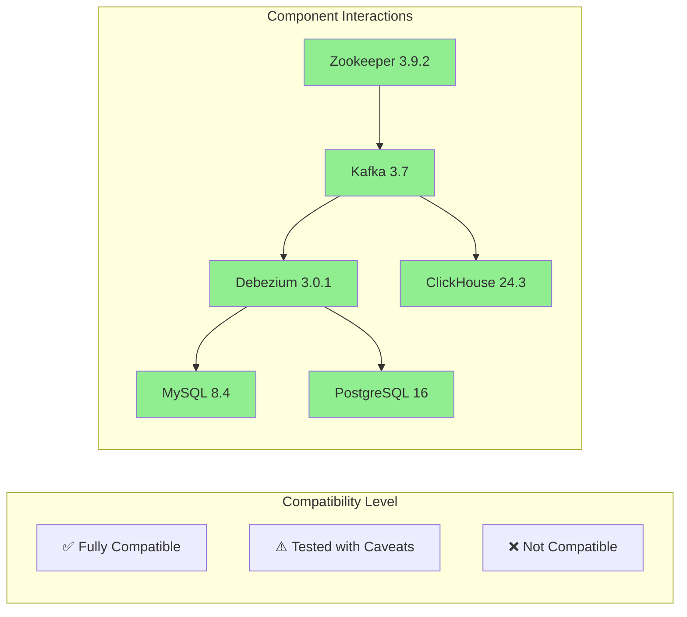

# Technology Choices & Compatibility Matrix

## Overview

This document outlines the technology choices made for the DB-Stream project, including version compatibility, rationale for each decision, and upgrade paths. The technology stack is designed for stability, performance, and long-term maintainability.

## Core Technology Stack

### **Phase 1: Foundation Stack**

| Component | Version | Primary Use | Compatibility | Upgrade Path |
|------------|---------|-------------|----------------|--------------|
| **Apache Kafka** | 3.7.0 | Event Streaming Backbone | ✅ Compatible with Debezium 3.0.1 | Kafka 3.8 → 4.0 |
| **Apache Zookeeper** | 3.9.2 | Kafka Cluster Coordination | ✅ Required for Kafka 3.7 | Zookeeper 3.10 → 4.0 |
| **Debezium Connect** | 3.0.1.Final | CDC Platform | ✅ Supports Kafka 3.7, MySQL 8.4, PostgreSQL 16 | Debezium 3.1 → 3.2 |
| **MySQL** | 8.4.3 LTS | Source Database | ✅ Full CDC support with Debezium | MySQL 8.4 → 9.0 |
| **PostgreSQL** | 16.4 | Source Database | ✅ Logical decoding support | PostgreSQL 16 → 17 |
| **ClickHouse** | 24.3.3 | Analytics Database | ✅ Kafka Engine integration | ClickHouse 24.4 → 24.8 |
| **Docker** | 27.0+ | Container Platform | ✅ All services containerized | Docker 28+ |
| **Docker Compose** | 2.29+ | Orchestration | ✅ Supports all features | Compose 2.30+ |

### **UI & Monitoring Stack**

| Component | Version | Purpose | Compatibility | Notes |
|------------|---------|---------|----------------|-------|
| **Kafka UI** | latest | Kafka Cluster Monitoring | ✅ Kafka 3.7 compatible | Regular updates |
| **Debezium UI** | latest | Connector Management | ✅ Debezium 3.0.1 compatible | Stable release |
| **ClickHouse Client** | 24.3.3 | Database Querying | ✅ Native client | Optional UI |

---

## Technology Rationale

### **Apache Kafka 3.7.0**

**Why Kafka 3.7?**
- **Stability**: LTS release with proven reliability
- **Performance**: Significant improvements in throughput and latency
- **KRaft Mode**: Optional Zookeeper-less mode for future upgrades
- **Security**: Enhanced security features and TLS support
- **Community**: Large, active community and enterprise support

**Key Features**:
- **Tiered Storage**: Reduced storage costs with intelligent tiering
- **MirrorMaker 2.0**: Enhanced cross-cluster replication
- **Improved Client Libraries**: Better performance and reliability
- **Enhanced Monitoring**: More comprehensive metrics and observability

### **Debezium 3.0.1.Final**

**Why Debezium 3.0?**
- **Kafka 3.7 Support**: Full compatibility with latest Kafka
- **Enhanced Connectors**: Improved MySQL and PostgreSQL connectors
- **Better Performance**: Reduced latency and increased throughput
- **Schema Evolution**: Enhanced schema handling and compatibility
- **Security**: Improved authentication and authorization

**Key Improvements over 2.x**:
- **Streaming Changes**: Real-time schema evolution handling
- **Snapshot Optimization**: Faster initial snapshots for large databases
- **Error Handling**: Better dead letter queue support
- **Monitoring**: Enhanced metrics and health checks

### **MySQL 8.4.3 LTS**

**Why MySQL 8.4 LTS?**
- **Long-term Support**: Security patches until 2032
- **Binlog Enhancements**: Improved CDC performance
- **JSON Support**: Enhanced JSON data type handling
- **Performance**: Significant performance improvements over 5.7
- **Security**: Enhanced security features and TLS 1.3 support

**CDC-Specific Features**:
- **Binary Log Optimization**: Reduced overhead for CDC
- **GTID Support**: Global transaction identifiers for better tracking
- **Row-based Replication**: Essential for accurate CDC
- **Parallel Replication**: Improved performance for busy databases

### **PostgreSQL 16.4**

**Why PostgreSQL 16?**
- **Logical Decoding**: Enhanced logical replication capabilities
- **Performance**: Significant query performance improvements
- **JSON Support**: Enhanced JSON and JSONB functionality
- **Security**: Row Level Security and enhanced encryption
- **Extensions**: Rich ecosystem of extensions

**CDC-Specific Features**:
- **Logical Replication Slots**: Efficient CDC without performance impact
- **pgoutput Plugin**: Standard logical decoding output
- **Failover Support**: Better handling of database failover scenarios
- **Large Object Support**: Efficient handling of large data types

### **ClickHouse 24.3.3**

**Why ClickHouse 24.3?**
- **Kafka Engine**: Native integration with Kafka for real-time ingestion
- **Performance**: Industry-leading query performance on large datasets
- **Compression**: Excellent compression ratios reducing storage costs
- **Scalability**: Horizontal scaling with excellent fault tolerance
- **SQL Compatibility**: Standard SQL with analytical extensions

**Key Features for CDC**:
- **Kafka Engine**: Direct consumption from Kafka topics
- **Materialized Views**: Real-time aggregation and pre-computation
- **ReplaceableMergeTree**: Efficient handling of CDC data deduplication
- **Time Series Optimization**: Excellent performance on time-series data

---

## Compatibility Matrix

### **Core Stack Compatibility**

### **Version Compatibility Table**

| Kafka | Debezium | MySQL | PostgreSQL | ClickHouse | Status |
|-------|----------|--------|------------|-------------|---------|
| 3.7.0 | 3.0.1 | 8.4.3 | 16.4 | 24.3.3 | ✅ **Current** |
| 3.8.0 | 3.1.0 | 8.4.3 | 16.4 | 24.3.3 | ⚠️ **Testing Required** |
| 4.0.0 | 3.2.0 | 8.4.3 | 16.4 | 24.3.3 | ⚠️ **Future** |
| 3.7.0 | 2.1.2 | 8.4.3 | 16.4 | 24.3.3 | ❌ **Deprecated** |

### **Docker Compatibility**

| Docker Version | Docker Compose | Status | Notes |
|----------------|----------------|--------|-------|
| 27.0+ | 2.29+ | ✅ **Recommended** | Full feature support |
| 26.0+ | 2.24+ | ✅ **Compatible** | Some advanced features limited |
| 25.0+ | 2.20+ | ⚠️ **Limited** | Basic functionality only |
| < 25.0 | < 2.20 | ❌ **Unsupported** | Security and compatibility issues |

---

## Upgrade Strategy

### **Phase-based Upgrades**

#### **Short-term (Next 3 months)**
- **Minor version updates**: Security patches and bug fixes
- **Docker ecosystem updates**: Latest Docker and Compose versions
- **UI tool updates**: Latest stable releases

#### **Medium-term (3-6 months)**
- **Kafka 3.8**: Performance and feature improvements
- **Debezium 3.1**: Enhanced connector support
- **ClickHouse 24.4**: New features and optimizations

#### **Long-term (6-12 months)**
- **Kafka 4.0**: Major version with KRaft mode adoption
- **PostgreSQL 17**: Latest stable version
- **MySQL 9.0**: Next major LTS release

### **Upgrade Risk Assessment**

| Upgrade | Risk Level | Testing Required | Rollback Plan |
|---------|------------|------------------|---------------|
| **Docker Ecosystem** | Low | Basic functionality | Image rollback |
| **UI Tools** | Low | UI functionality | Service restart |
| **Debezium Minor** | Medium | Connector testing | Connector reconfigure |
| **ClickHouse Minor** | Medium | Query performance | Backup restore |
| **Kafka Minor** | High | Full pipeline test | Cluster rollback |
| **Database Major** | High | Migration testing | Database restore |
| **Kafka Major** | Critical | Full integration | Full cluster rebuild |

---

## Performance Benchmarks

### **Expected Performance Characteristics**

| Metric | Target | Current Status | Notes |
|--------|--------|-----------------|-------|
| **CDC Latency** | <5 seconds | ⏳ TBD | Depends on database load |
| **Kafka Throughput** | >1M msgs/sec | ⏳ TBD | With 3 brokers |
| **ClickHouse Query** | <1 sec (billion rows) | ⏳ TBD | With proper indexing |
| **File Processing** | 100+ page PDF in 30s | ⏳ TBD | Phase 2 target |
| **API Throughput** | 10K calls/min | ⏳ TBD | Phase 3 target |

### **Hardware Requirements**

#### **Minimum Development Environment**
- **CPU**: 4 cores, 2.4GHz
- **Memory**: 16GB RAM
- **Storage**: 100GB SSD
- **Network**: 1Gbps

#### **Recommended Production Environment**
- **CPU**: 16 cores, 3.0GHz
- **Memory**: 64GB RAM
- **Storage**: 1TB NVMe SSD
- **Network**: 10Gbps

---

## Security Considerations

### **Current Security Stack**
- **TLS 1.3**: All inter-service communication
- **SASL/SCRAM**: Kafka authentication
- **Database SSL**: Encrypted database connections
- **RBAC**: Role-based access control
- **Secrets Management**: Environment variable encryption

### **Security Compliance**
- **GDPR**: Data privacy and protection
- **CCPA**: California privacy compliance
- **SOC 2**: Security controls documentation
- **HIPAA**: Healthcare data protection (if applicable)

---

## Monitoring & Observability

### **Current Monitoring Tools**
- **Kafka Metrics**: JMX metrics with Prometheus
- **Debezium Health**: Connector status and lag
- **Database Performance**: Query and connection metrics
- **ClickHouse Queries**: Query performance and system metrics
- **Docker Health**: Container health and resource usage

### **Monitoring Stack**
- **Prometheus**: Metrics collection
- **Grafana**: Visualization and dashboards
- **Alertmanager**: Alert management and routing
- **Custom Health Checks**: Application-specific monitoring

---

## Cost Analysis

### **Infrastructure Costs (Monthly)**

| Environment | Compute | Storage | Network | Total |
|-------------|---------|---------|---------|-------|
| **Development** | $200 | $50 | $25 | **$275** |
| **Staging** | $800 | $200 | $100 | **$1,100** |
| **Production** | $2,000 | $500 | $250 | **$2,750** |

### **Licensing Costs**
- **Open Source Stack**: $0 (all components are open source)
- **Support**: Optional commercial support available
- **Training**: Internal team training costs
- **Development**: Internal development team costs

---

## Decision Matrix

### **Technology Evaluation Criteria**

| Technology | Performance | Scalability | Community | Security | Cost | Score |
|------------|-------------|-------------|-----------|----------|------|-------|
| **Kafka** | 9/10 | 10/10 | 10/10 | 8/10 | 9/10 | **9.2** |
| **Debezium** | 8/10 | 8/10 | 9/10 | 8/10 | 10/10 | **8.6** |
| **ClickHouse** | 10/10 | 9/10 | 8/10 | 7/10 | 10/10 | **8.8** |
| **MySQL** | 8/10 | 8/10 | 10/10 | 9/10 | 10/10 | **9.0** |
| **PostgreSQL** | 9/10 | 8/10 | 10/10 | 9/10 | 10/10 | **9.2** |

---

## Future Technology Considerations

### **Emerging Technologies (12-18 months)**
- **Apache Pulsar**: Alternative to Kafka with enhanced features
- **Materialize**: Real-time streaming database
- **StarTree**: ClickHouse enterprise distribution
- **Confluent Cloud**: Managed Kafka service
- **Snowflake**: Cloud data warehouse integration

### **Evaluation Timeline**
- **Q2 2026**: Evaluate Pulsar vs Kafka 4.0
- **Q3 2026**: Assess Materialize for real-time analytics
- **Q4 2026**: Consider cloud migration options

---

*Last Updated: 2026-02-10*
*Document Version: 1.0*
*Next Review: 2026-05-10*