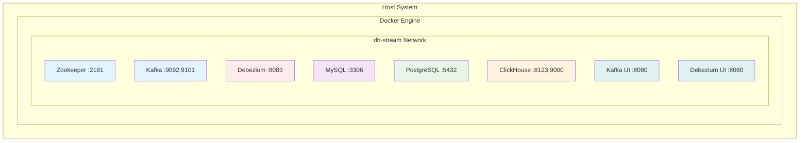

# Docker Architecture & Configuration

## Overview

This document details the Docker architecture for the DB-Stream project, including container configurations, networking strategies, volume management, and deployment considerations. The Docker setup is designed for both development and production environments.

## Container Architecture

### **Service Container List**

| Container Name | Image | Purpose | Port(s) | Volume(s) |
|----------------|-------|---------|---------|-----------|
| **zookeeper** | confluentinc/cp-zookeeper:7.6.0 | Kafka coordination | 2181 | zookeeper-data |
| **kafka** | confluentinc/cp-kafka:7.6.0 | Event streaming | 9092, 9101 | kafka-data |
| **debezium** | debezium/connect:3.0.1.Final | CDC platform | 8083 | debezium-config |
| **mysql** | mysql:8.4.3 | Source database | 3306 | mysql-data |
| **postgres** | postgres:16.4 | Source database | 5432 | postgres-data |
| **clickhouse** | clickhouse/clickhouse-server:24.3.3 | Analytics DB | 8123, 9000 | clickhouse-data |
| **kafka-ui** | provectuslabs/kafka-ui:latest | Kafka monitoring | 8080 | - |
| **debezium-ui** | debezium/debezium-ui:2.4 | Connector management | 8080 | - |

### **Network Architecture**



#### **Network Configuration**
- **Network Name**: `db-stream`
- **Driver**: `bridge` (development), `overlay` (production)
- **Internal**: `false` (allow external access for UI tools)
- **IPAM**: Default Docker IP address management

### **Volume Strategy**

#### **Named Volumes for Persistence**
```yaml
volumes:
  zookeeper-data:
    driver: local
  kafka-data:
    driver: local
  mysql-data:
    driver: local
  postgres-data:
    driver: local
  clickhouse-data:
    driver: local
  debezium-config:
    driver: local
```

#### **Volume Mount Points**
| Volume | Container Mount | Purpose | Backup Strategy |
|--------|-----------------|---------|-----------------|
| `zookeeper-data` | `/var/lib/zookeeper/data` | Zookeeper state | Snapshots |
| `kafka-data` | `/var/lib/kafka/data` | Kafka logs | Retention + backup |
| `mysql-data` | `/var/lib/mysql` | MySQL databases | Regular backups |
| `postgres-data` | `/var/lib/postgresql/data` | PostgreSQL data | pg_dump backups |
| `clickhouse-data` | `/var/lib/clickhouse` | ClickHouse tables | Backups + snapshots |

---

## Service Configurations

### **Zookeeper Configuration**

#### **Environment Variables**
```yaml
environment:
  ZOOKEEPER_CLIENT_PORT: 2181
  ZOOKEEPER_TICK_TIME: 2000
  ZOOKEEPER_SYNC_LIMIT: 2
```

#### **Health Check**
```yaml
healthcheck:
  test: ["CMD", "nc", "-z", "localhost", "2181"]
  interval: 30s
  timeout: 10s
  retries: 3
  start_period: 20s
```

### **Kafka Configuration**

#### **Environment Variables**
```yaml
environment:
  KAFKA_BROKER_ID: 1
  KAFKA_ZOOKEEPER_CONNECT: zookeeper:2181
  KAFKA_LISTENER_SECURITY_PROTOCOL_MAP: PLAINTEXT:PLAINTEXT,PLAINTEXT_HOST:PLAINTEXT
  KAFKA_ADVERTISED_LISTENERS: PLAINTEXT://kafka:29092,PLAINTEXT_HOST://localhost:9092
  KAFKA_OFFSETS_TOPIC_REPLICATION_FACTOR: 1
  KAFKA_TRANSACTION_STATE_LOG_MIN_ISR: 1
  KAFKA_TRANSACTION_STATE_LOG_REPLICATION_FACTOR: 1
  KAFKA_GROUP_INITIAL_REBALANCE_DELAY_MS: 0
  KAFKA_JMX_PORT: 9101
  KAFKA_JMX_HOSTNAME: localhost
```

#### **Health Check**
```yaml
healthcheck:
  test: ["CMD", "kafka-broker-api-versions", "--bootstrap-server", "localhost:9092"]
  interval: 30s
  timeout: 10s
  retries: 3
  start_period: 40s
```

### **Debezium Connect Configuration**

#### **Environment Variables**
```yaml
environment:
  BOOTSTRAP_SERVERS: kafka:29092
  GROUP_ID: 1
  CONFIG_STORAGE_TOPIC: my_connect_configs
  OFFSET_STORAGE_TOPIC: my_connect_offsets
  STATUS_STORAGE_TOPIC: my_connect_statuses
  KEY_CONVERTER: org.apache.kafka.connect.json.JsonConverter
  VALUE_CONVERTER: org.apache.kafka.connect.json.JsonConverter
  INTERNAL_KEY_CONVERTER: org.apache.kafka.connect.json.JsonConverter
  INTERNAL_VALUE_CONVERTER: org.apache.kafka.connect.json.JsonConverter
  KEY_CONVERTER_SCHEMAS_ENABLE: "false"
  VALUE_CONVERTER_SCHEMAS_ENABLE: "false"
  INTERNAL_KEY_CONVERTER_SCHEMAS_ENABLE: "false"
  INTERNAL_VALUE_CONVERTER_SCHEMAS_ENABLE: "false"
```

#### **Custom Plugins**
```yaml
# Additional connector plugins can be mounted here
volumes:
  - ./connectors:/kafka/connect
```

#### **Health Check**
```yaml
healthcheck:
  test: ["CMD", "curl", "-f", "http://localhost:8083/connectors"]
  interval: 30s
  timeout: 10s
  retries: 3
  start_period: 60s
```

### **MySQL Configuration**

#### **Environment Variables**
```yaml
environment:
  MYSQL_ROOT_PASSWORD: debezium
  MYSQL_USER: mysqluser
  MYSQL_PASSWORD: mysqlpw
  MYSQL_DATABASE: inventory
```

#### **Configuration Files**
```yaml
volumes:
  - ./config/mysql/my.cnf:/etc/mysql/conf.d/my.cnf:ro
  - ./scripts/mysql/init.sql:/docker-entrypoint-initdb.d/init.sql:ro
```

#### **my.cnf Configuration**
```ini
[mysqld]
server-id = 184054
log-bin = mysql-bin
binlog_format = ROW
binlog_row_image = FULL
expire_logs_days = 10
max_binlog_size = 100M
gtid_mode = ON
enforce_gtid_consistency = ON
```

#### **Health Check**
```yaml
healthcheck:
  test: ["CMD", "mysqladmin", "ping", "-h", "localhost"]
  interval: 30s
  timeout: 10s
  retries: 3
  start_period: 30s
```

### **PostgreSQL Configuration**

#### **Environment Variables**
```yaml
environment:
  POSTGRES_USER: postgres
  POSTGRES_PASSWORD: postgres
  POSTGRES_DB: postgres
```

#### **Configuration Files**
```yaml
volumes:
  - ./config/postgresql/postgresql.conf:/etc/postgresql/postgresql.conf:ro
  - ./scripts/postgres/init.sql:/docker-entrypoint-initdb.d/init.sql:ro
```

#### **postgresql.conf Configuration**
```ini
# CDC Configuration
wal_level = logical
max_wal_senders = 10
max_replication_slots = 10
track_commit_timestamp = on

# Performance
shared_buffers = 256MB
effective_cache_size = 1GB
maintenance_work_mem = 64MB
checkpoint_completion_target = 0.9
```

#### **Health Check**
```yaml
healthcheck:
  test: ["CMD-SHELL", "pg_isready -U postgres"]
  interval: 30s
  timeout: 10s
  retries: 3
  start_period: 30s
```

### **ClickHouse Configuration**

#### **Environment Variables**
```yaml
environment:
  CLICKHOUSE_DB: default
  CLICKHOUSE_USER: default
  CLICKHOUSE_PASSWORD: ""
  CLICKHOUSE_DEFAULT_ACCESS_MANAGEMENT: 1
```

#### **Configuration Files**
```yaml
volumes:
  - ./config/clickhouse/config.xml:/etc/clickhouse-server/config.xml:ro
  - ./config/clickhouse/users.xml:/etc/clickhouse-server/users.xml:ro
```

#### **config.xml Key Settings**
```xml
<?xml version="1.0"?>
<clickhouse>
    <listen_host>::</listen_host>
    <http_port>8123</http_port>
    <tcp_port>9000</tcp_port>
    
    <!-- Kafka Integration -->
    <kafka>
        <enable>kafka</enable>
        <max_poll_records>1000</max_poll_records>
        <poll_timeout_ms>1000</poll_timeout_ms>
        <max_block_size>65536</max_block_size>
    </kafka>
    
    <!-- Performance Tuning -->
    <max_memory_usage>10000000000</max_memory_usage>
    <max_bytes_before_external_group_by>2000000000</max_bytes_before_external_group_by>
    <max_bytes_before_external_sort>2000000000</max_bytes_before_external_sort>
</clickhouse>
```

#### **Health Check**
```yaml
healthcheck:
  test: ["CMD", "wget", "--no-verbose", "--tries=1", "--spider", "http://localhost:8123/ping"]
  interval: 30s
  timeout: 10s
  retries: 3
  start_period: 30s
```

---

## UI Services Configuration

### **Kafka UI Configuration**

#### **Environment Variables**
```yaml
environment:
  KAFKA_CLUSTERS_0_NAME: local
  KAFKA_CLUSTERS_0_BOOTSTRAPSERVERS: kafka:29092
  KAFKA_CLUSTERS_0_ZOOKEEPER: zookeeper:2181
```

#### **Health Check**
```yaml
healthcheck:
  test: ["CMD", "wget", "--no-verbose", "--tries=1", "--spider", "http://localhost:8080"]
  interval: 30s
  timeout: 10s
  retries: 3
  start_period: 30s
```

### **Debezium UI Configuration**

#### **Environment Variables**
```yaml
environment:
  KAFKA_CONNECT_URIS: http://debezium:8083
```

#### **Health Check**
```yaml
healthcheck:
  test: ["CMD", "wget", "--no-verbose", "--tries=1", "--spider", "http://localhost:8080"]
  interval: 30s
  timeout: 10s
  retries: 3
  start_period: 30s
```

---

## File Structure

### **Project Directory Layout**
```
db-stream/
├── docker-compose.yml                 # Main Docker Compose file
├── docker-compose.dev.yml            # Development overrides
├── docker-compose.prod.yml           # Production configuration
├── .env                               # Environment variables
├── docker/                            # Custom Dockerfiles
│   ├── debezium/
│   │   └── Dockerfile                 # Custom Debezium image
│   ├── mysql/
│   │   └── Dockerfile                 # MySQL with custom config
│   ├── postgres/
│   │   └── Dockerfile                 # PostgreSQL with extensions
│   └── clickhouse/
│       └── Dockerfile                 # ClickHouse with plugins
├── config/                            # Configuration files
│   ├── mysql/
│   │   └── my.cnf                     # MySQL configuration
│   ├── postgres/
│   │   └── postgresql.conf            # PostgreSQL configuration
│   ├── clickhouse/
│   │   ├── config.xml                 # ClickHouse main config
│   │   └── users.xml                  # ClickHouse users config
│   └── kafka/
│       └── server.properties          # Kafka configuration
├── scripts/                           # Initialization scripts
│   ├── mysql/
│   │   └── init.sql                   # MySQL database setup
│   ├── postgres/
│   │   └── init.sql                   # PostgreSQL database setup
│   └── clickhouse/
│       └── init.sql                   # ClickHouse table setup
├── connectors/                        # Additional Kafka Connect plugins
├── monitoring/                        # Monitoring and alerting configs
│   ├── prometheus/
│   ├── grafana/
│   └── alertmanager/
└── logs/                             # Log aggregation setup
```

### **Custom Dockerfiles**

#### **Debezium Dockerfile**
```dockerfile
FROM debezium/connect:3.0.1.Final

# Add custom connectors or plugins
COPY connectors/ /kafka/connect/

# Install additional tools
RUN apt-get update && apt-get install -y \
    curl \
    jq \
    && rm -rf /var/lib/apt/lists/*

# Add custom configuration
COPY config/debezium/application.properties /kafka/config/application.properties
```

#### **MySQL Dockerfile**
```dockerfile
FROM mysql:8.4.3

# Copy custom configuration
COPY config/mysql/my.cnf /etc/mysql/conf.d/

# Copy initialization scripts
COPY scripts/mysql/ /docker-entrypoint-initdb.d/

# Install additional tools
RUN apt-get update && apt-get install -y \
    curl \
    && rm -rf /var/lib/apt/lists/*

# Expose metrics port
EXPOSE 3306 9104
```

#### **PostgreSQL Dockerfile**
```dockerfile
FROM postgres:16.4

# Copy custom configuration
COPY config/postgresql/postgresql.conf /etc/postgresql/postgresql.conf
COPY config/postgresql/pg_hba.conf /etc/postgresql/pg_hba.conf

# Copy initialization scripts
COPY scripts/postgres/ /docker-entrypoint-initdb.d/

# Install additional extensions
RUN apt-get update && apt-get install -y \
    postgresql-16-wal2json \
    && rm -rf /var/lib/apt/lists/*
```

#### **ClickHouse Dockerfile**
```dockerfile
FROM clickhouse/clickhouse-server:24.3.3

# Copy custom configuration
COPY config/clickhouse/config.xml /etc/clickhouse-server/config.xml
COPY config/clickhouse/users.xml /etc/clickhouse-server/users.xml

# Copy initialization scripts
COPY scripts/clickhouse/init.sql /docker-entrypoint-initdb.d/init.sql

# Install additional tools
RUN apt-get update && apt-get install -y \
    curl \
    wget \
    && rm -rf /var/lib/apt/lists/*
```

---

## Environment Configuration

### **.env File**
```bash
# Version Management
KAFKA_VERSION=3.7.0
DEBEZIUM_VERSION=3.0.1.Final
MYSQL_VERSION=8.4.3
POSTGRES_VERSION=16.4
CLICKHOUSE_VERSION=24.3.3

# Network Configuration
NETWORK_NAME=db-stream

# Database Credentials
MYSQL_ROOT_PASSWORD=debezium
MYSQL_USER=mysqluser
MYSQL_PASSWORD=mysqlpw
MYSQL_DATABASE=inventory

POSTGRES_USER=postgres
POSTGRES_PASSWORD=postgres
POSTGRES_DB=postgres

# ClickHouse Configuration
CLICKHOUSE_USER=default
CLICKHOUSE_PASSWORD=
CLICKHOUSE_DB=default

# UI Configuration
KAFKA_UI_PORT=8080
DEBEZIUM_UI_PORT=8081

# Monitoring Configuration
JMX_PORT=9101
METRICS_ENABLED=true
```

### **Environment-Specific Overrides**

#### **Development (docker-compose.dev.yml)**
```yaml
version: '3.8'
services:
  kafka:
    ports:
      - "9092:9092"
      - "9101:9101"
  
  debezium:
    ports:
      - "8083:8083"
    environment:
      CONNECT_LOG_LEVEL: DEBUG
      CONNECT_PLUGIN_PATH: /kafka/connect,/usr/share/java
  
  mysql:
    ports:
      - "3306:3306"
  
  postgres:
    ports:
      - "5432:5432"
  
  clickhouse:
    ports:
      - "8123:8123"
      - "9000:9000"
```

#### **Production (docker-compose.prod.yml)**
```yaml
version: '3.8'
services:
  kafka:
    deploy:
      replicas: 3
    resources:
      limits:
        memory: 4G
        cpus: '2'
  
  debezium:
    deploy:
      replicas: 2
    resources:
      limits:
        memory: 2G
        cpus: '1'
  
  mysql:
    deploy:
      replicas: 1
    resources:
      limits:
        memory: 8G
        cpus: '4'
  
  postgres:
    deploy:
      replicas: 1
    resources:
      limits:
        memory: 4G
        cpus: '2'
  
  clickhouse:
    deploy:
      replicas: 2
    resources:
      limits:
        memory: 16G
        cpus: '8'
```

---

## Deployment Strategies

### **Development Deployment**
```bash
# Start all services
docker-compose up -d

# View logs
docker-compose logs -f

# Scale specific services
docker-compose up -d --scale kafka=3

# Stop all services
docker-compose down
```

### **Production Deployment**
```bash
# Use production configuration
docker-compose -f docker-compose.yml -f docker-compose.prod.yml up -d

# Deploy with health checks
docker-compose -f docker-compose.yml -f docker-compose.prod.yml up -d --wait

# Rolling updates
docker-compose -f docker-compose.yml -f docker-compose.prod.yml up -d --no-deps debezium
```

### **Backup and Recovery**

#### **Volume Backups**
```bash
# Backup all volumes
docker run --rm -v db-stream_zookeeper-data:/data -v $(pwd):/backup alpine tar czf /backup/zookeeper-backup.tar.gz -C /data .
docker run --rm -v db-stream_kafka-data:/data -v $(pwd):/backup alpine tar czf /backup/kafka-backup.tar.gz -C /data .
docker run --rm -v db-stream_mysql-data:/data -v $(pwd):/backup alpine tar czf /backup/mysql-backup.tar.gz -C /data .

# Restore volumes
docker run --rm -v db-stream_mysql-data:/data -v $(pwd):/backup alpine tar xzf /backup/mysql-backup.tar.gz -C /data
```

#### **Database-Specific Backups**
```bash
# MySQL backup
docker-compose exec mysql mysqldump -u root -p${MYSQL_ROOT_PASSWORD} --all-databases > mysql-backup.sql

# PostgreSQL backup
docker-compose exec postgres pg_dump -U ${POSTGRES_USER} ${POSTGRES_DB} > postgres-backup.sql

# ClickHouse backup
docker-compose exec clickhouse clickhouse-client --query="BACKUP TABLE *.* TO Disk('backups')"
```

---

## Security Configuration

### **Network Security**
- **Isolated Network**: Services on dedicated `db-stream` network
- **Port Exposure**: Only necessary ports exposed to host
- **Internal Communication**: All inter-service communication via internal network

### **Authentication Configuration**
- **Database Authentication**: Strong passwords for all databases
- **Kafka Security**: SASL/SCRAM authentication (production)
- **ClickHouse Security**: User-based access control

### **Secrets Management**
- **Environment Variables**: Sensitive data in .env file
- **Docker Secrets**: For production deployment
- **External Secret Stores**: Integration with HashiCorp Vault (future)

---

## Monitoring and Logging

### **Log Configuration**
```yaml
logging:
  driver: "json-file"
  options:
    max-size: "100m"
    max-file: "3"
    labels: "service,environment"
```

### **Monitoring Integration**
- **JMX Metrics**: Kafka and Zookeeper metrics
- **Database Metrics**: MySQL, PostgreSQL, ClickHouse export
- **Container Metrics**: Docker container resource usage
- **Custom Metrics**: Debezium connector metrics

---

*Last Updated: 2026-02-10*
*Document Version: 1.0*