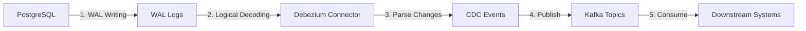

# PostgreSQL CDC Implementation Guide

## Overview

This document explains how Debezium monitors PostgreSQL database changes using Change Data Capture (CDC) and pushes them to Kafka for real-time processing.

## How Debezium Monitors PostgreSQL Changes

### Architecture Flow



### Step-by-Step Process

1. **WAL (Write-Ahead Log)**: PostgreSQL writes all database changes to WAL first
2. **Logical Decoding**: Debezium connects via replication protocol and reads WAL
3. **Change Detection**: Debezium monitors the replication slot for new changes
4. **Event Transformation**: Converts WAL changes to structured JSON
5. **Kafka Publishing**: Sends events to Kafka topics

## Required PostgreSQL Configuration

### 1. Enable Logical Decoding

```sql
-- Enable logical decoding (required for CDC)
ALTER SYSTEM SET wal_level = 'logical';

-- Allow replication connections
ALTER SYSTEM SET max_replication_slots = 10;
ALTER SYSTEM SET max_wal_senders = 10;

-- Restart PostgreSQL to apply changes
-- Or reload configuration: SELECT pg_reload_conf();
```

### 2. Create Replication Slot

```sql
-- Create a replication slot for Debezium
-- Uses pgoutput plugin for logical decoding
SELECT * FROM pg_create_logical_replication_slot('debezium', 'pgoutput');

-- Check existing replication slots
SELECT * FROM pg_replication_slots;
```

### 3. Create Publication

```sql
-- Create publication for all tables
CREATE PUBLICATION dbstream_publication FOR ALL TABLES;

-- Or create for specific tables only
CREATE PUBLICATION dbstream_publication FOR TABLE 
    users, products, orders, order_items, categories;

-- Check publication tables
SELECT * FROM pg_publication_tables;
```

## Debezium Configuration

### Docker Compose Setup

```yaml
debezium:
  image: debezium/connect:2.4
  hostname: debezium
  depends_on:
    - kafka
    - postgres
  ports:
    - "8083:8083"
  environment:
    BOOTSTRAP_SERVERS: kafka:29092
    GROUP_ID: debezium-connect-cluster
    CONFIG_STORAGE_TOPIC: connect_configs
    OFFSET_STORAGE_TOPIC: connect_offsets
    STATUS_STORAGE_TOPIC: connect_statuses
    KEY_CONVERTER: org.apache.kafka.connect.json.JsonConverter
    VALUE_CONVERTER: org.apache.kafka.connect.json.JsonConverter
```

### Debezium Connector Configuration

```json
{
  "name": "postgres-inventory-connector",
  "config": {
    "connector.class": "io.debezium.connector.postgresql.PostgresConnector",
    "database.hostname": "postgres",
    "database.port": "5432",
    "database.user": "db_stream",
    "database.password": "db_stream_password",
    "database.dbname": "db_stream_source",
    "database.server.name": "dbstream-postgres",
    "topic.prefix": "dbstream-postgres",
    "plugin.name": "pgoutput",
    "publication.name": "dbstream_publication",
    "table.include.list": "public.users,public.products,public.orders,public.order_items,public.categories",
    "database.history.kafka.bootstrap.servers": "kafka:29092",
    "database.history.kafka.topic": "schema-changes.dbstream-postgres",
    "key.converter": "org.apache.kafka.connect.json.JsonConverter",
    "value.converter": "org.apache.kafka.connect.json.JsonConverter",
    "key.converter.schemas.enable": "false",
    "value.converter.schemas.enable": "false"
  }
}
```

## CDC Event Format

### Example Debezium Event

```json
{
  "before": null,
  "after": {
    "id": 1,
    "email": "john.doe@example.com",
    "first_name": "John",
    "last_name": "Doe",
    "created_at": "2026-02-10T17:54:12.672748Z",
    "updated_at": "2026-02-10T17:54:12.672748Z"
  },
  "source": {
    "version": "2.4.2.Final",
    "connector": "postgresql",
    "name": "dbstream-postgres",
    "ts_ms": 1770749112960,
    "snapshot": "first",
    "db": "db_stream_source",
    "sequence": "[null,\"26790176\"]",
    "schema": "public",
    "table": "users",
    "txId": 757,
    "lsn": 26790176,
    "xmin": null
  },
  "op": "c",
  "ts_ms": 1770749113052,
  "transaction": null
}
```

### Operation Types

| Op Code | Meaning | Description |
|---------|---------|-------------|
| `c` | Create | INSERT operation |
| `u` | Update | UPDATE operation |
| `d` | Delete | DELETE operation |
| `r` | Read | Snapshot (initial load) |

## Key Components Explained

### 1. WAL (Write-Ahead Log)

- PostgreSQL's transaction log
- Records all database changes before they're committed
- Required for crash recovery and replication

### 2. Replication Slot

- Debezium's "cursor" in the transaction log
- Maintains position even if Debezium restarts
- Prevents WAL from being recycled until processed

### 3. Publication

- Defines which tables to monitor
- Can include all tables or specific tables
- Controls what data Debezium captures

### 4. pgoutput Plugin

- PostgreSQL's built-in logical decoding output plugin
- Converts WAL to readable format
- Required for Debezium PostgreSQL connector

## Kafka Topics Created

When Debezium runs, it creates topics for each monitored table:

```
dbstream-postgres.public.users       # User table changes
dbstream-postgres.public.products    # Product table changes
dbstream-postgres.public.orders      # Order table changes
dbstream-postgres.public.order_items # Order items changes
dbstream-postgres.public.categories  # Category table changes
```

## Verification Commands

### Check PostgreSQL CDC Status

```sql
-- Check WAL level
SELECT setting FROM pg_settings WHERE name = 'wal_level';

-- Check replication slots
SELECT slot_name, plugin, active FROM pg_replication_slots;

-- Check publications
SELECT * FROM pg_publication_tables;

-- Check current data in tables
SELECT COUNT(*) FROM users;
SELECT COUNT(*) FROM products;
```

### Check Debezium Status

```bash
# Check connector status
curl -s http://localhost:8083/connectors

# Check specific connector
curl -s http://localhost:8083/connectors/postgres-inventory-connector/status
```

### Check Kafka Topics

```bash
# List all topics
docker exec db-stream-kafka kafka-topics --bootstrap-server localhost:9092 --list

# List CDC topics only
docker exec db-stream-kafka kafka-topics --bootstrap-server localhost:9092 --list | grep dbstream
```

### Monitor CDC Events

```bash
# Watch user changes in real-time
docker exec db-stream-kafka kafka-console-consumer \
  --bootstrap-server localhost:9092 \
  --topic dbstream-postgres.public.users \
  --from-beginning

# Watch specific number of messages
docker exec db-stream-kafka kafka-console-consumer \
  --bootstrap-server localhost:9092 \
  --topic dbstream-postgres.public.users \
  --max-messages 5 --from-beginning
```

## Troubleshooting

### Common Issues

1. **WAL Level Not Logical**
   - Error: `wal_level is insufficient to publish logical changes`
   - Fix: `ALTER SYSTEM SET wal_level = 'logical';`

2. **Replication Slot Not Active**
   - Check: `SELECT * FROM pg_replication_slots;`
   - Fix: Recreate slot with `SELECT pg_create_logical_replication_slot('debezium', 'pgoutput');`

3. **Debezium Cannot Connect to Kafka**
   - Error: `Couldn't resolve server kafka:29092`
   - Fix: Ensure Kafka is running and network is configured properly

4. **Changes Not Appearing in Kafka**
   - Check if Debezium connector is RUNNING
   - Check PostgreSQL replication slot status
   - Verify publication includes the table

## Port Changes Impact

If PostgreSQL port changes (e.g., from 5432 to 5433):

1. Update docker-compose.yml:
```yaml
ports:
  - "5433:5432"  # Host:Container
```

2. Update Debezium connector:
```json
{
  "database.port": "5433"
}
```

3. Update any client connections

## Summary

Debezium automatically monitors PostgreSQL by:
1. Connecting via PostgreSQL replication protocol
2. Reading from a logical replication slot
3. Parsing WAL (Write-Ahead Log) entries
4. Transforming binary data to JSON
5. Publishing to Kafka topics in real-time

This enables sub-second latency from database change to downstream consumption.

```sql
SELECT 
    'WAL Level' as setting,
    (SELECT setting FROM pg_settings WHERE name = 'wal_level') as value
UNION ALL
SELECT 
    'Replication Slots',
    (SELECT setting FROM pg_settings WHERE name = 'max_replication_slots')
UNION ALL
SELECT 
    'WAL Senders', 
    (SELECT setting FROM pg_settings WHERE name = 'max_wal_senders')
UNION ALL
SELECT 
    'Replication Slot Status',
    COALESCE(
        (SELECT slot_name || ': ' || active::text FROM pg_replication_slots WHERE slot_name = 'debezium'),
        'Slot not found'
    );
sl
```

---

*Last Updated: 2026-02-12*
*Document Version: 1.0*
